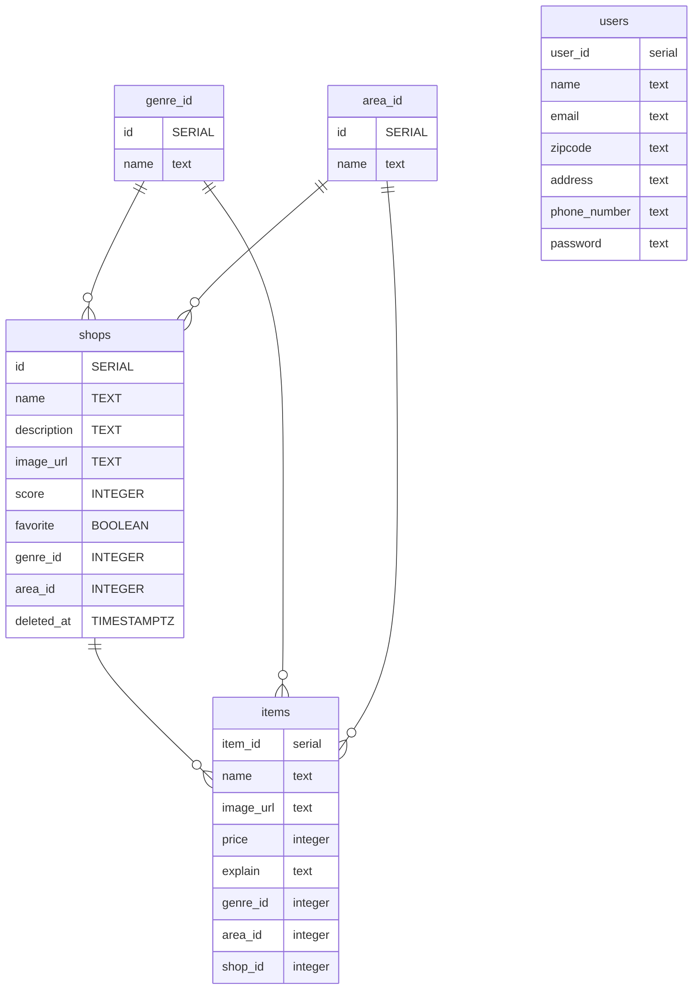

<!-- carts {
  id integer
  user_id integer
}

cart_items {
  cart_id UUID
  item_id UUID
}

orders {
  id UUID
  user_id UUID
  status INTEGER
  payment_method INTEGER
  amount BIGINT
  ordered_at TIMESTAMPTZ 
  delivered_at TIMESTAMPTZ
}

order_items {
  order_id UUID
  item_id UUID
  name TEXT
  price BIGINT
  description TEXT
  image_url TEXT
  quantity INTEGER
} -->
